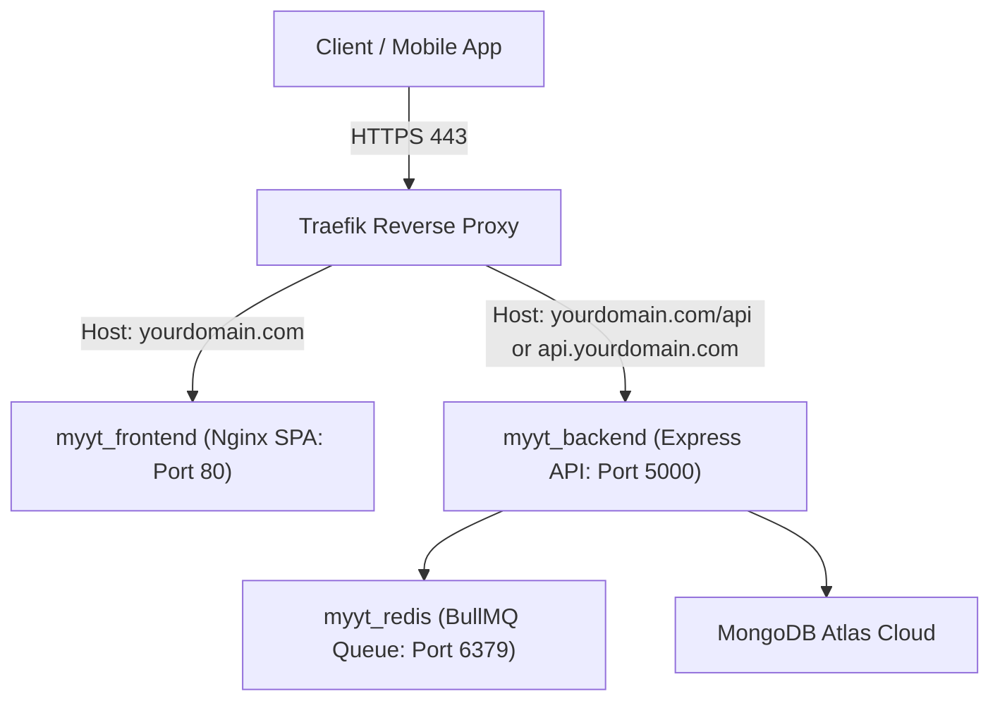

# 🚀 VPS Deployment Guide for myYT Web (with Traefik)

This guide walks you through deploying the **myYT Web Platform** (Backend API, Frontend SPA, and Redis) on your VPS using Docker and your existing **Traefik** reverse proxy.

---

## 📁 Architecture Overview



---

## 🛠️ Step-by-Step Deployment Steps

### Step 1: Copy `myYT_web` to Your VPS

Upload or git clone the `myYT_web` folder to your VPS:

```bash
scp -r ./myYT_web user@your-vps-ip:/opt/myyt_web
```
*(Or clone your repository onto the server and `cd /opt/myyt_web`)*

---

### Step 2: Create Your Production `.env` File

Navigate to the project folder on your VPS:

```bash
cd /opt/myyt_web
cp .env.production.example .env
nano .env
```

Set your configuration values:
- `DOMAIN`: Your domain name (e.g. `myyt.com` or `app.yourdomain.com`)
- `TRAEFIK_NETWORK`: The Docker network name Traefik uses (e.g. `traefik_web` or `proxy`)
- `CERT_RESOLVER`: Your Traefik ACME resolver name (e.g. `letsencrypt` or `myresolver`)
- `MONGODB_URI`: Your MongoDB connection string

---

### Step 3: Launch with Docker Compose

Run the following command to build and launch the containers in the background:

```bash
docker compose up -d --build
```

---

### Step 4: Verify Deployment & Health Check

1. Check that all 3 containers are running:
   ```bash
   docker compose ps
   ```

2. Inspect backend logs:
   ```bash
   docker compose logs -f backend
   ```

3. Test backend health check endpoint:
   ```bash
   curl https://yourdomain.com/api/health
   ```

---

## 📱 Connecting the Mobile App to Production

Once deployed, update `myYT_mobile/.env` with your VPS production domain:

```env
EXPO_PUBLIC_API_URL=https://yourdomain.com/api
```

Both the web platform and mobile app will now be synced in real-time on your live production server!
